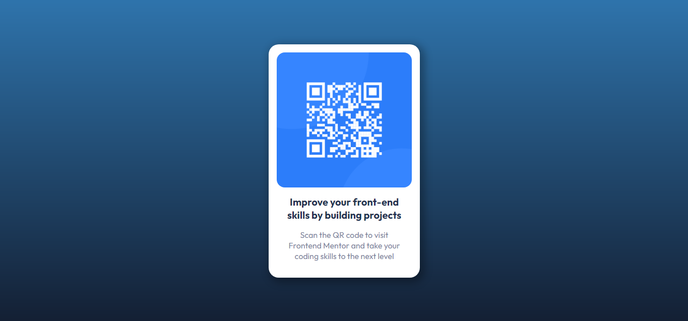

# Frontend Mentor - QR code component solution

This is a solution to the [QR code component challenge on Frontend Mentor](https://www.frontendmentor.io/challenges/qr-code-component-iux_sIO_H). Frontend Mentor challenges help you improve your coding skills by building realistic projects. 

## Table of contents

- [Overview](#overview)
  - [The challenge](#the-challenge)
  - [Screenshot](#screenshot)
  - [Links](#links)
- [My process](#my-process)
  - [Built with](#built-with)
  - [Useful resources](#useful-resources)
- [Author](#author)

## Overview

### The challenge

Users should be able to:

- View the optimal layout depending on their device's screen size
- See hover states for interactive elements

### Screenshot

Desktop Version
 

 
Mobile Version
 

### Links

- Solution URL: [https://github.com/halderjoydeep/FM-QR-card](https://github.com/halderjoydeep/FM-QR-card)
- Live Site URL: [https://halderjoydeep.github.io/FM-QR-card/](https://halderjoydeep.github.io/FM-QR-card/)

## My process

### Built with

- Semantic HTML5 markup
- CSS custom properties
- Flexbox
- CSS Grid

### Useful resources

- [Traversy Media](https://www.youtube.com/watch?v=0xMQfnTU6oo)

## Author

- Website - [Joydeep Halder](https://joydeephalder.me)
- Frontend Mentor - [@halderjoydeep](https://www.frontendmentor.io/profile/halderjoydeep)
- Github - [@halderjoydeep](https://github.com/halderjoydeep)
- LinkedIn - [Joydeep Halder](https://linkedin.com/in/joydeep-halder)
